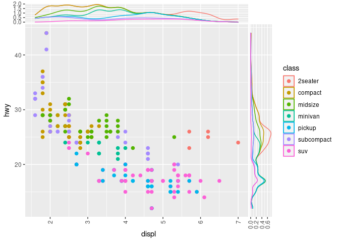

README
================
Justin Landis
7/21/2020

# ggside

## Overview

The R package ggside expands on the ggplot2 package. This package allows
the user to add graphical information about one of the main panel’s
axis. This is particulary useful for metadata for discrete axis, or
summary graphics on a continuous axis such as a boxplot or a density
distribution.

## Installation

``` r
devtools::install_github("jtlandis/ggside")
```

## Usage

Using this package is similar to adding any additional layer to a
ggplot. All geometries supported by ggside follow a pattern like
`geom_xside*` or `geom_yside*` which will add that geometery to either
the x side panel or the y side panel respecitively. If you add
`geom_xsidedensity` to a plot, then this places a density geometry in
its own panel that is positioned by default above the main panel. This
panel will share the same x axis of the main panel but will have an
independent y axis. Take the following example from the ggplot2 readme.

``` r
library(ggplot2)
library(ggside)
#> 
#> Attaching package: 'ggside'
#> The following objects are masked from 'package:ggplot2':
#> 
#>     flip_data, flipped_names, gg_dep, has_flipped_aes, remove_missing,
#>     scale_type, should_stop, waiver

ggplot(mpg, aes(displ, hwy, colour = class)) + 
  geom_point(size = 2) +
  geom_xsidedensity(aes(y = after_stat(density)), position = "stack") +
  geom_ysidedensity(aes(x = after_stat(density)), position = "stack", orientation = "y") +
  theme(axis.text.x = element_text(angle = 90, vjust = .5))
```

<!-- -->

There is currently a vignette in development that goes into further
details on the package.
